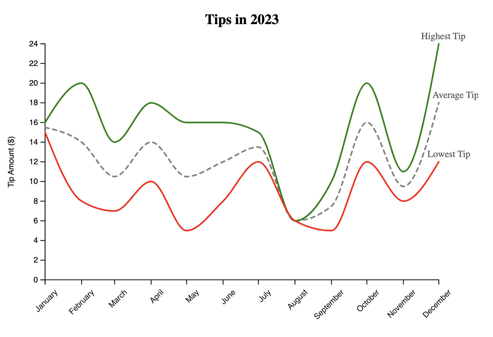

# Tips Received in 2023: Multiple Line Chart

This visualization features a multiple line chart showing the highest and lowest tips received throughout 2023. I used a semi-traffic light color scheme for clarity: 

- **Green**: Represents the highest tips.
- **Red**: Indicates the lowest tips.
- **Gray**: Average tips.

Yellow was too washed out. Despite its subtle appearance, gray remains a crucial color in the visualization.

The chart has a dashed line to better separate the lines. The labels were included to provide context, but implementing them was more difficult than I imagined.

