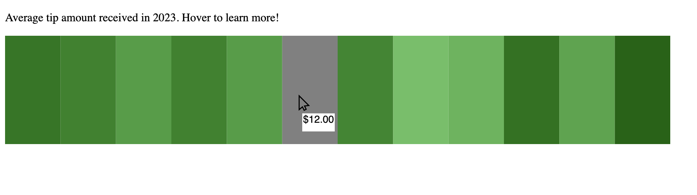

# Interactive visualization of tips received in 2023

For this visualization, I decided to experiment with a vertical stacked bar format to create a more dynamic and engaging experience. Instead of using static labels and text, I concealed these elements behind tooltips that appear when hovered over.

I represented the months with varying shades of green, where darker shades indicate months with higher average tips. One of the main challenges I faced was my limited design skills. I adopted a gamification strategy for the interactive aspect of this project, aiming to make the data exploration both fun and informative.

